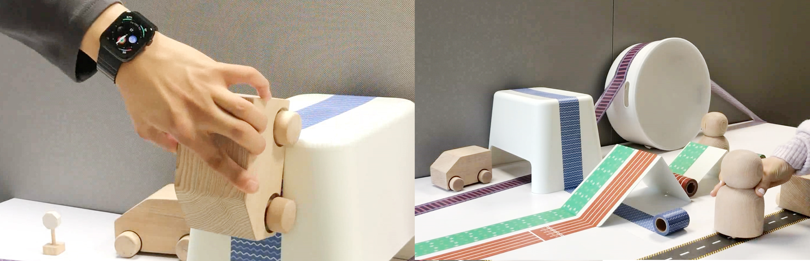

**Make Some Noise!**
  

  
TapeBot is a modular robotic kit for creating an interactive environment.

**Role & Outcome** 

 
• 2019-2020
 
• Team Project 
Dahyun Kang: Interaction design, scale mock-ups and interactive prototypes development, Writing a paper
 
Sonya S. Kwak: Design direction, Interaction design, scale mock-ups and interactive prototypes development, Writing a paper
 
Hanbyeol Lee: Interaction design, Pre-Production Prototypes development
 
• Tools: Arduino
 
• Output: High fidelity working prototypes (table-top product)
  

**Background** 

Many robotic kits enable children to design various robotic characters with plenty of flexibility and creativity, such as humanoids, robotic animals, and robotic faces. However, because a robot is an artifact that perceives an environment and responds to it accordingly, it can also be characterized by the environment it encounters.
  

{: width="100%" height="100%"}

  

**Design Concept**

We propose a modular robotic kit that is aimed at creating an interactive environment for which a robot produces various responses.  
We chose intelligent tapes to build the environment for the following reasons: 
1. We believe that the tape, which is found in everyday life, is a perfect material to lower the consumers’ expectation toward the product and will be helpful for the consumer’s acceptance of it. 
2. The tape is a familiar and enjoyable material for children, and it can be used as a flexible module, which users can cut into whatever size they want and can be attached and detached with ease.
  

**Paper**

Kwak, S. S., Kang, D., Lee, H., & Choi, J. (2020, March). TapeBot: Modular Robotic Kit for Creating an Interactive Environment. *In Companion of the 2020 ACM/IEEE International Conference on Human-Robot Interaction*, pp. 74-74. 
  

- Category: Product Design, UX Design
{:.list-inline}
