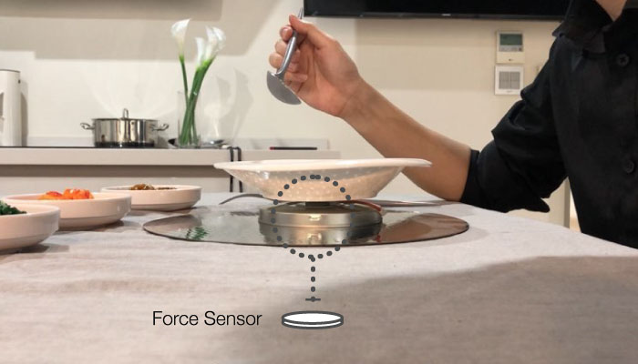
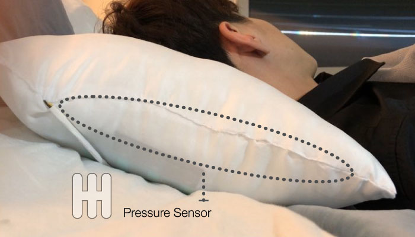
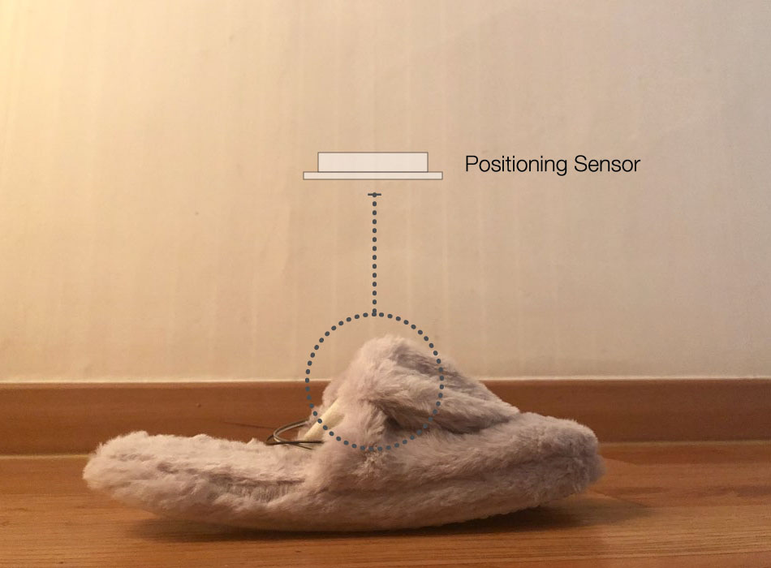

Intelligent product for measuring the symptom of dementia(IPSD) measures changes in dietary habits, sleep patterns, and athletic performance abilities of the dementia patient, respectively without changing patients’ environment.

**Role & Outcome** 

 
• 2018
 
• Team Project 
Dahyun Kang: Team organization and management, Design direction, UI planning, User scenario design, Interactive prototypes development
 
Hwawoo Jeon: Interactive prototypes development
 
Jinhong Noh: Interactive prototypes development
 
• Tools: Arduino
 
• Output: High fidelity working prototypes
  

**Background**
In modern society, as the average life span of people has been steadily increasing due to the development of medical technology, the cost of dementia treatment and burden of dementia care has become a social problem. In case of patients with dementia (PwD), early diagnosis is important. After early diagnosis, proper treatment can relieve the symptoms of dementia and slow the progress of the disease. Robotic technology can help to get diagnosis early, and treatment appropriately. However, A robot is a very new concept object to the ordinary people except for engineers and robot experts. In addition, environmental changes can give a negative impact on PwD. Therefore, rather than putting the robot-like robot into PwD's environment, it may be more effective for patient care to interact with the familiar products.

**Design Concept**
IPSDs were designed by applying robotic technology to daily necessities since products which are familiar to the user allow interaction with the user continuously and regularly, to measure the symptoms of dementia.

{: width="100%" height="100%"}
 

*Dish*   Intelligent Dish Approximately 80% of patients with dementia has dietary behavior disorders, and dietary behavior disorders result in reduced food intake and weight loss in the elderly with dementia. In addition, patients with dementia loss of self-control, such as eating sweets too much, or overdrinking, and it can manifest the symptom of binge eating. Our dish perceives the weight of the foods by using the weight sensor. It cognizes the amount of food the patient ate, and the number of meals. The dish reports the collected data to the application so that it can be seen by PwD, families of PwD, caregivers, and doctors. 

{: width="100%" height="100%"}
 

*Pillow* In a study of McCurry and his colleagues on dementia, 40% of the 205 Alzheimer's  patients had hypersomnia, 31% awake too early, and  24% had frequent arousal. Our pillow  perceives the pressure by the patient head through the nine pressure sensors. It cognizes sleep hours, and tossing and turning of the patient. The pillow reports the changes of patients’ quantity and quality of sleeping to the application.

{: width="100%" height="100%"}
 

*Shoe* Problems in pace and equilibrium can be the first signs of Alzheimer's disease. If there is an abnormality in equilibrium sensation, the upper body moves left and right and back and forth when standing in position. Our shoes perceive that the patients’ body center of gravity movement when the patient stands still. It cognizes patients’ good balance or poor balance. The shoes report the changes in PwD’s balance sense.

{:.list-inline}
- Category: Interaction Design, Intelligent Product Design

