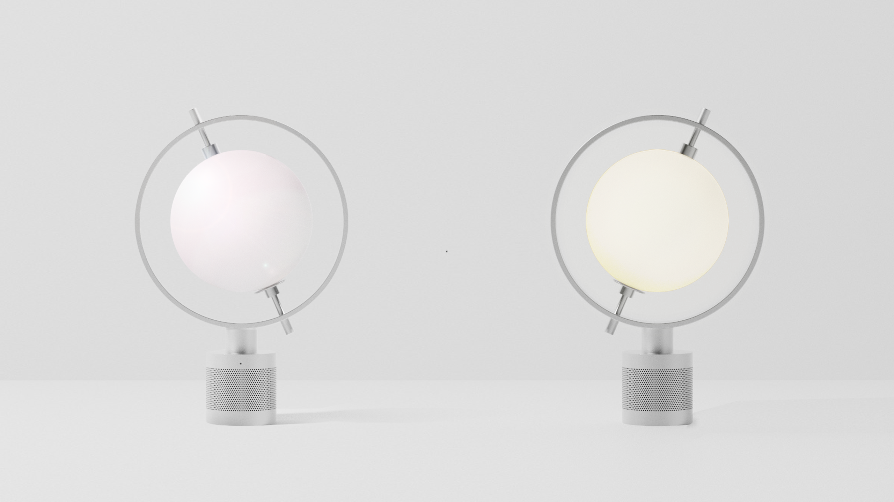

**Spin the Globe and Your Journey Begins!**

tr*i*ple is a smart speaker that aims to virtual travels during quarantine. With tr*i*ple, users can enjoy a virtual trip through three sensory experiences: visual (light), auditory (background sound, and voice assistant), and tactile experiences (temperature control synchronized with the local temperature). 

<!--  -->

**Role & Outcome**

• 2020

• Team Project

Dahyun Kang: Design direction, Information architecture, UI planning, User scenario design, Product Modeling

Seunggyu Gim: Product Modeling, Rendering

Hanbyeol Lee: Embodied system, Backend development

• Tools: Arduino, Onshape

• Output: High fidelity working prototypes (table-top product)

**Background**

**Idea Sketch**

In order to address the challenges above, we developed tr*i*ple, a smart speaker providing three types of sensory stimulations.

• Metaphoric design

The design motif of tr*i*ple is from a globe. When a user spins the globe, the globe lights up and the journey begins. It will make the user more immersed in virtual travel. tr*i*ple is designed not too reminiscent of a specific country or region. The non-descriptive design with a sphere and transformed cylinders will help limit the user's imagination. 

**Interaction Scenarios**

optional info list (delete if not using):

{:.list-inline} 
