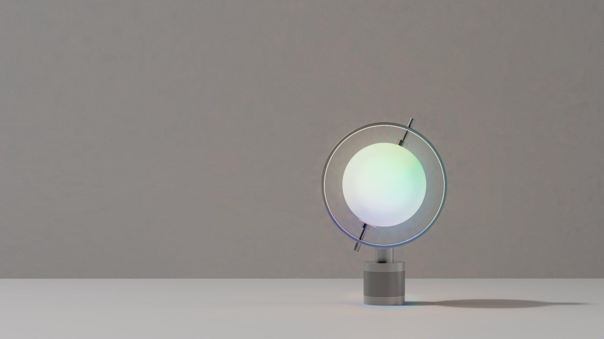
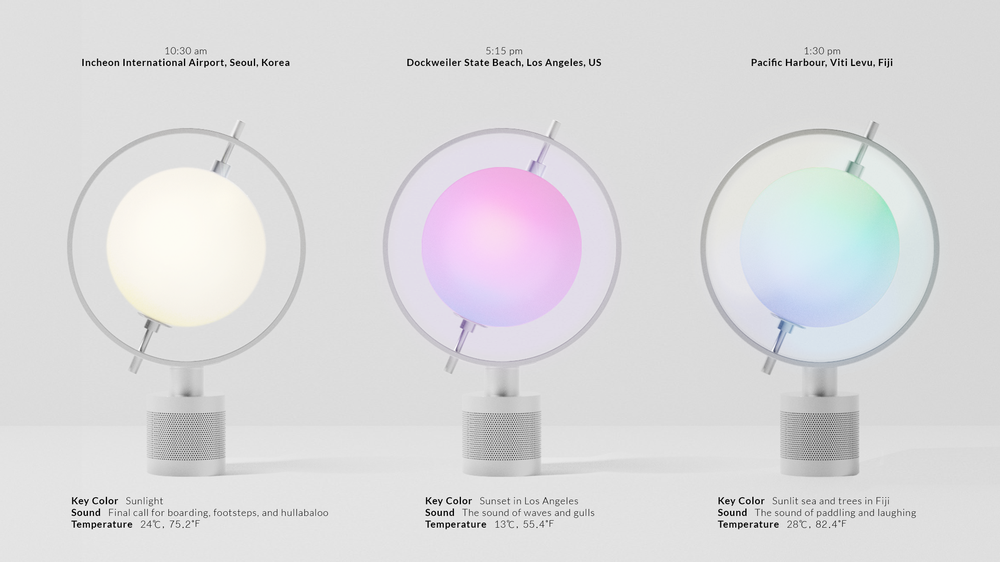

**Spin the Globe and Your Journey Begins!**

tr*i*ple is a smart speaker that aims to virtual travels during quarantine. With tr*i*ple, users can enjoy a virtual trip through three sensory experiences: visual (light), auditory (background sound, and voice assistant), and tactile experiences (temperature control synchronized with the local temperature). 

{: width="100%" height="100%"}

**Role & Outcome**

 
 
• 2020
 
• Team Project  
Dahyun Kang: Design direction, Information architecture, UI planning, User scenario design, Product Modeling
 
Seunggyu Gim: Product Modeling, Rendering
 
Hanbyeol Lee: Embodied system, Backend development
 
• Tools: Arduino, Onshape
 
• Output: High fidelity working prototypes (table-top product)
  

**Background**  

We have lost the pleasure of the trip sicne many countries have closed the borders due to COVID19. Accordingly, we designed an interactive product that allows users to virtual travel the world at home, tr*i*ple.
  

**Idea Sketch**

In order to address the challenges above, we developed tr*i*ple, a smart speaker providing three types of sensory stimulations.

• Metaphoric design

The design motif of tr*i*ple is from a globe. When a user spins the globe, the globe lights up and the journey begins. It will make the user more immersed in virtual travel. tr*i*ple is designed not too reminiscent of a specific country or region. The non-descriptive design with a sphere and transformed cylinders will help limit the user's imagination. 
  

**Interaction Scenarios**

{: width="100%" height="100%"}

optional info list (delete if not using):

{:.list-inline} 
